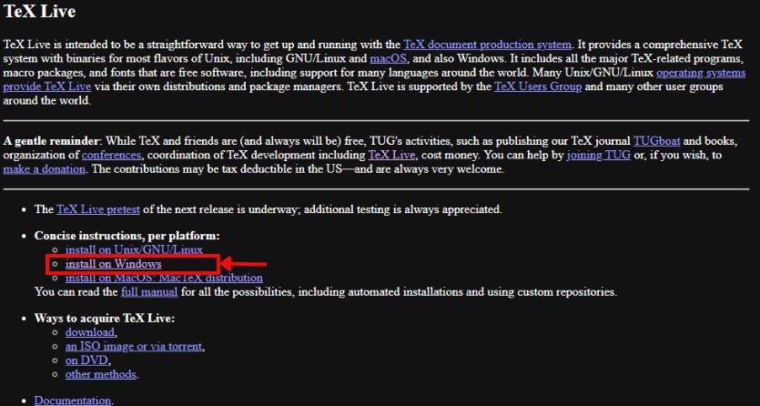
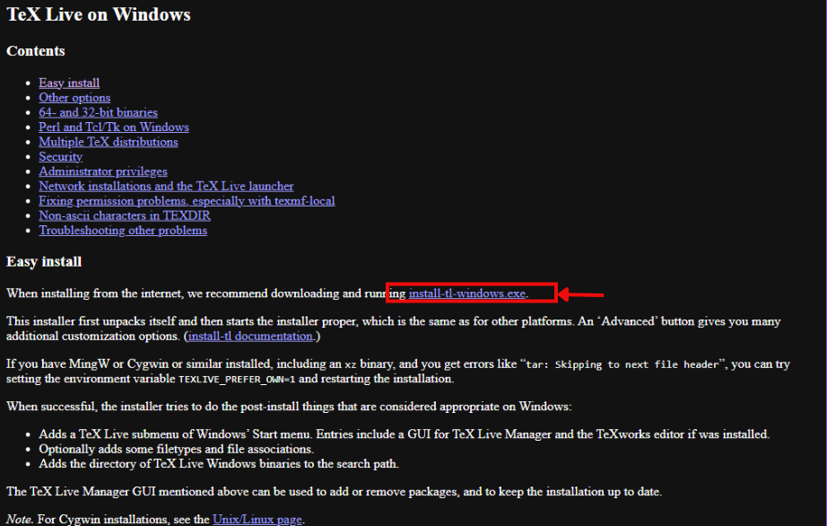
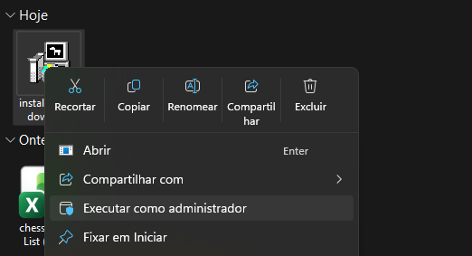
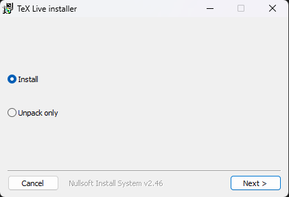
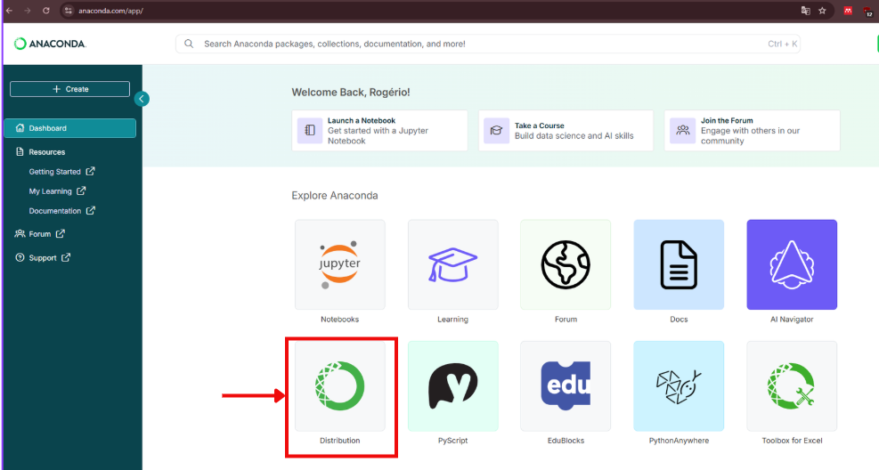
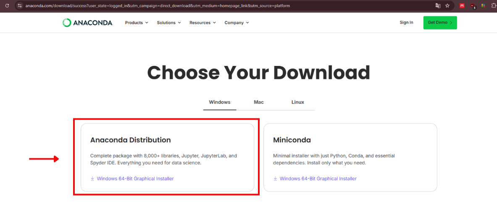

# 1. instalação do Latex

## Baixando o Tex Live

É recomendável a instalação do Tex Live para que não ocorra erros. É possível usar o MikTex ou TinyTex, mas esses versionadores podem causar erros.

Site para instalação do Tex Live: https://www.tug.org/texlive/

## Instalação do Tex Live

1. Se certifique que qualquer bloqueador (como antivirus ou TinyWall) ou firewall não bloqueie o acesso a internet desse arquivo.

2. Execute o arquivo baixado como administrado, clique em next e depois install. É muito importante que esteja com acesso a internet!

3. Escolha onde deve ficar instalados os pacotes, eles podem ocupar bastante espaço. Essa etapa é bem demorada e pode levar horas para que os arquivos sejam baixados.

# 2. Instalação do Anaconda

Essa etapa serve para instalar o VS Code, ele já pode estar instalado no seu computador mas a Anaconda trás várias outras ferramentas que podem ser úteis, por isso recomendo essa instalação.

1. Acesse o site: https://anaconda.com/app/
2. Crie uma conta, essa etapa é bem rápida se usar sua conta google e clicar em "skip" nas opções após criar a conta.
3. O Anaconda Dristribution. 

4. Baixe o instalador do Anaconda
